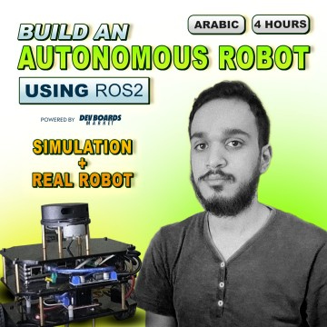

# diffbot_course

## This repository is part of [this course](https://devboardsmarket.com/products/autonomous-robot-using-ros2-arabic-course)
Language of Instruction: Arabic

Certificate of Completion

Access to Course Resources

### What you'll learn

✓ Build Autonomous Robots in both Real World and Simulation environments using ROS2.

✓ Master ROS2 control and navigation with the Nav2 Stack.

✓ Learn essential Bash scripting for efficient robot programming.

✓ Explore Gazebo for simulation and world building.

✓ Interface Raspberry Pi and Arduino with your robots.

✓ Apply SLAM techniques in ROS2 for mapping and localization in diverse environments.

### Requirements

Basic Python and C++ (its okay if you're beginner, everything is explained in the course)

Linux basic commands in a terminal (Recommended).

### Who is this course for?

→ Beginner who wants to learn how to build an Autonomous Robot.

→ Mid-Level and Advanced seeking hands-on experience with ROS2 frameworks.

To purchase click [here](https://devboardsmarket.com/products/autonomous-robot-using-ros2-arabic-course)
